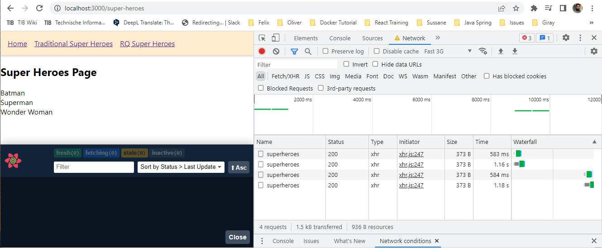
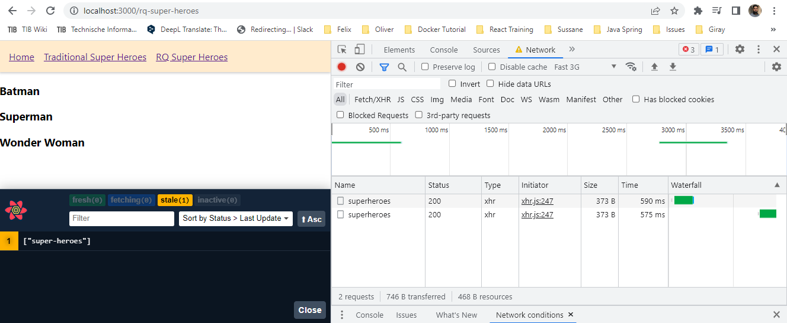
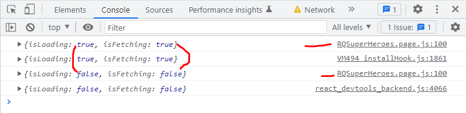
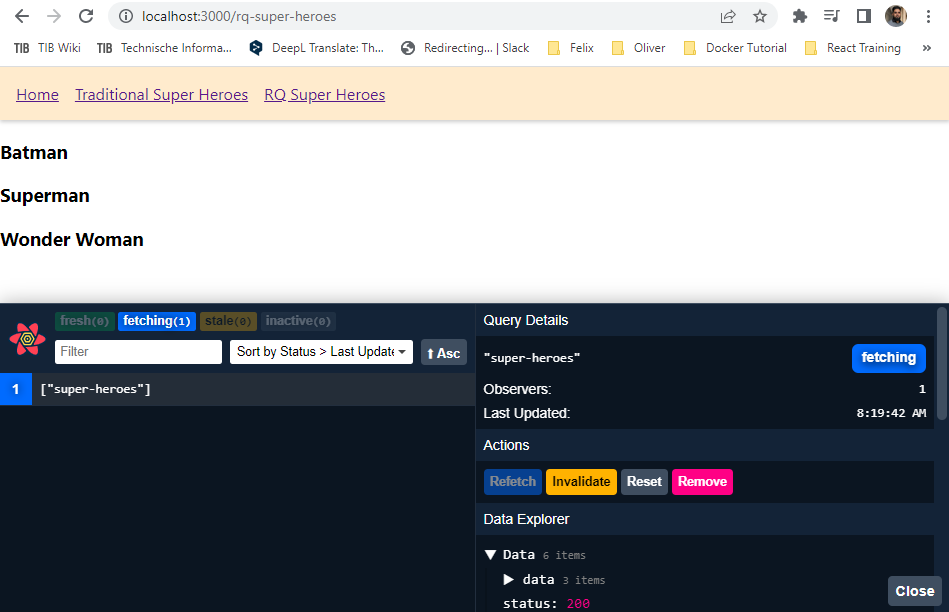
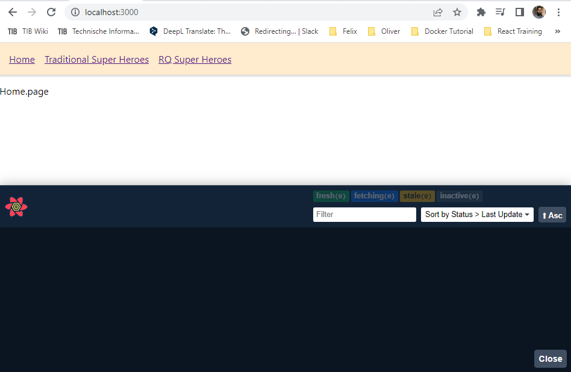
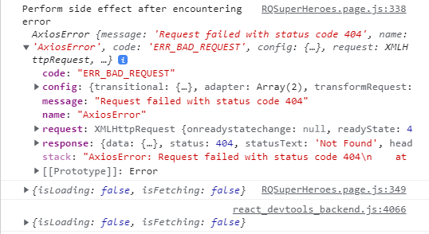
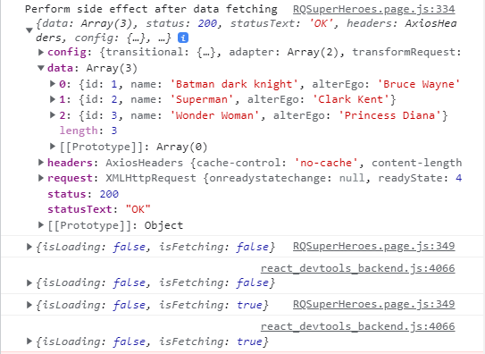

# Getting Started with React-Query

## lecture 1 Introduction

### React Query

- what is React Query
- A library for fetching data in a React application

### Why React Query

1. Since React is a UI library, there is no specific pattern for data fetching
2. we use `useEffect` hook for data fetching and `useState` hook to maintain component state like loading, error or resulting data
3. if the data is need throughout the app, we tend to use state management libraries
4. most of the state management libraries are good for working with client state. for example theme for the application / whether a modal is open
5. state management libraries are not great for working with `asynchronous or server state`

## Client vs Server state

### Client State

- client state is persisted in your app memory and accessing or updating it is synchronous

### Server State

1. persisted remotely and requires asynchronous APIs for fetching or updating
2. has shared ownership
3. Data can be updated by someone else without your knowledge
4. UI data may not be in sync with the remote data
5. Challenging when you have to deal with `caching`, `deduping multiple request for the same data`, `updating stale data in the background`, `performance optimizations` etc

## lecture 2 Project Setup

1. new react project using create react app
2. set up an API endpoint that serves mock data for use in our application
3. set up react router and a few routes in the application
4. fetch data the traditional way using useEffect and useState

### new react project

`npx create-react-app react_query_demo`

### Setup API endpoints

- we will use JSON server for this purpose
- JSON server not only support `GET` request but also `POST` request which we will need in this series

1. install json-server

```
npm install json-server
```

2. create a file `db.json` in the root folder which will serve as an API data

```
{
  "superheroes": [
    {
      "id": 1,
      "name": "Batman",
      "alterEgo": "Bruce Wayne"
    },
    {
      "id": 2,
      "name": "Superman",
      "alterEgo": "Clark Kent"
    },
    {
      "id": 3,
      "name": "Wonder Woman",
      "alterEgo": "Princess Diana"
    }
  ]
}
```

3. to serve this data on an endpoint we need to add an `npm script` in `package.json` file
4. in the `scripts` we need to add one line

```
  "scripts": {
    "start": "react-scripts start",
    "build": "react-scripts build",
    "test": "react-scripts test",
    "eject": "react-scripts eject",
    "serve-json": "json-server --watch db.json --port 4000" // add this line
  },
```

5. go to terminal and write

```
npm run serve-json
```

6. we can see the data from `db.json` on localhost:4000/superheroes

### setup react router and a few routes

1. install react-router-dom

```
npm install react-router-dom
```

2. to setup a few routes. create a `component folder` inside `src` and create 3 files inside

- Home.page.js
- RQSuperHeroes.page.js
- SuperHeroes.page.js

3. in these files we will fetch data in the upcoming videos.
4. replace App.js with this code

```
import { BrowserRouter as Router, Switch, Route, Link } from 'react-router-dom'
import './App.css'
import { HomePage } from './components/Home.page'
import { RQSuperHeroesPage } from './components/RQSuperHeroes.page'
import { SuperHeroesPage } from './components/SuperHeroes.page'

function App() {
  return (
    <Router>
      <div>
        <nav>
          <ul>
            <li>
              <Link to='/'>Home</Link>
            </li>
            <li>
              <Link to='/super-heroes'>Traditional Super Heroes</Link>
            </li>
            <li>
              <Link to='/rq-super-heroes'>RQ Super Heroes</Link>
            </li>
          </ul>
        </nav>
        <Switch>
          <Route path='/super-heroes'>
            <SuperHeroesPage />
          </Route>
          <Route path='/rq-super-heroes'>
            <RQSuperHeroesPage />
          </Route>
          <Route path='/'>
            <HomePage />
          </Route>
        </Switch>
      </div>
    </Router>
  )
}

export default App
```

5. in App.css add this code

```
nav ul {
  display: flex;
  background-color: blanchedalmond;
  margin-block-start: 0;
  padding: 16px;
  box-shadow: 0 2px 4px rgba(0, 0, 0, 0.2);
}

nav ul li {
  list-style-type: none;
  margin-right: 16px;
}
```

6. in `SuperHeroes.page.js` component use the below code

```
import { useState, useEffect } from 'react'
import axios from 'axios'

export const SuperHeroesPage = () => {
  const [isLoading, setIsLoading] = useState(true)
  const [data, setData] = useState([])

  useEffect(() => {
    axios.get('http://localhost:4000/superheroes').then(res => {
      setData(res.data)
      setIsLoading(false)
    })
  }, [])

  if (isLoading) {
    return <h2>Loading...</h2>
  }

  return (
    <>
      <h2>Super Heroes Page</h2>
      {data.map(hero => {
        return <div>{hero.name}</div>
      })}
    </>
  )
}
```

7. the router used is working in this version ` "react-router-dom": "^5.2.0",`. change it to this if you have recent one in `package.json` file

## lecture 3 Fetching Data with useQuery (react-query version 3.19.2)

1. install react-querty using `npm install react-query@3.19.2`
2. in `App.js` component import 2 components `QueryClientProvider` and `QueryClient` from `react-query`

```
import {QueryClientProvider, QueryClient} from 'react-query'
```

3. in the `App.js` wrap the router inside `QueryClientProvider` component
4. create an instance of `QueryClient()` as `const queryClient = new QueryClient()`
5. finally provide a prop on `QueryClientProvider` as `client={queryClient}`. The full App.js code is now

```
import { BrowserRouter as Router, Switch, Route, Link } from 'react-router-dom';
import './App.css';
import { QueryClientProvider, QueryClient } from 'react-query';
import { HomePage } from './components/Home.page';
import { RQSuperHeroesPage } from './components/RQSuperHeroes.page';
import { SuperHeroesPage } from './components/SuperHeroes.page';

const queryClient = new QueryClient();

function App() {
  return (
    <QueryClientProvider client={queryClient}>
      <Router>
        <div>
          <nav>
            <ul>
              <li>
                <Link to="/">Home</Link>
              </li>
              <li>
                <Link to="/super-heroes">Traditional Super Heroes</Link>
              </li>
              <li>
                <Link to="/rq-super-heroes">RQ Super Heroes</Link>
              </li>
            </ul>
          </nav>
          <Switch>
            <Route path="/super-heroes">
              <SuperHeroesPage />
            </Route>
            <Route path="/rq-super-heroes">
              <RQSuperHeroesPage />
            </Route>
            <Route path="/">
              <HomePage />
            </Route>
          </Switch>
        </div>
      </Router>
    </QueryClientProvider>
  );
}

export default App;
```

### using useQuery in RQSuperHeroes component for fetching data

1. import `useQuery` from `react-query`

```
import {useQuery} from 'react-query'
```

2. import axios.
3. in the component body we will use `useQuery` hook.
4. useQuery accepts 2 parameters.

- first is a unique key which can be any name here we give `super-heroes`
- second parameter is a function which will return a Promise. we will use `axios.get()` to return a Promise.

5. so the `useQuery` hook will process it an return many different things which we can receive in a variable for example `const result`

```
// lecture 3 fetching data with useQuery
import axios from "axios";
import { useQuery } from "react-query";

export const RQSuperHeroesPage = () => {
  const result = useQuery('super-heroes', () => {
    return axios.get('http://localhost:4000/superheroes')
  })
  return <div>RQSuperHeroesPage</div>;
};
```

6. we can further destructure the `result` and get what we need from it like below

```
// lecture 3 fetching data with useQuery
import axios from 'axios';
import { useQuery } from 'react-query';

export const RQSuperHeroesPage = () => {
  // const result = useQuery('super-heroes', () => {
  // we can destructure  the result
  const { isLoading, data } = useQuery('super-heroes', () => {
    return axios.get('http://localhost:4000/superheroes');
  });

  if (isLoading) {
    return <h2>... is Loading</h2>;
  }
  return (
    <>
      {data?.data.map((hero) => {
        return <h3 key={hero.name}>{hero.name}</h3>;
      })}
    </>
  );
};
```

7. we can define the fetcher function outside of the `useQuery` hook

```
// fetcher function outside
import axios from 'axios';
import { useQuery } from 'react-query';

const fetchHeroes = () => {
  return axios.get('http://localhost:4000/superheroes');
};

export const RQSuperHeroesPage = () => {
  // const result = useQuery('super-heroes', () => {
  // we can destructure  the result
  const { isLoading, data } = useQuery('super-heroes', fetchHeroes);

  if (isLoading) {
    return <h2>... is Loading</h2>;
  }
  return (
    <>
      {data?.data.map((hero) => {
        return <h3 key={hero.name}>{hero.name}</h3>;
      })}
    </>
  );
};
```

## lecture 4 Handling Query Error

### Traditional way

1. first we will see the traditional way of error handling in `SuperHeroes.page.js` component.
2. the url is intentionally wrong to see the error
3. so we need one more `useState` for error handling in traditional way and a catch block of code.

```
// lecture 4 Handling Query Error
import { useState, useEffect } from 'react';
import axios from 'axios';

export const SuperHeroesPage = () => {
  const [isLoading, setIsLoading] = useState(true);
  const [data, setData] = useState([]);
  const [error, setError] = useState('');

  useEffect(() => {
    axios
      .get('http://localhost:4000/superheroe111')
      .then((res) => {
        setData(res.data);
        setIsLoading(false);
      })
      .catch((error) => {
        setError(error.message);
        setIsLoading(false);
      });
  }, []);

  if (error) {
    return <h2>{error}</h2>;
  }

  if (isLoading) {
    return <h2>Loading...</h2>;
  }

  return (
    <>
      <h2>Super Heroes Page</h2>
      {data.map((hero) => {
        return <div>{hero.name}</div>;
      })}
    </>
  );
};
```

### Error handling using useQuery()

1. from `useQuery()` output we can destructure `isError` and `error` also. which we can than use to handle the error and return another JSX.
2. in this case the loading text will show for a little longer because `react-query` attempts multiple tries to fetch the data and if the endpoint is not correct at the end it will throw an error

```
// lecture 4 handling query error
import axios from 'axios';
import { useQuery } from 'react-query';

const fetchHeroes = () => {
  return axios.get('http://localhost:4000/superheroes111');
};

export const RQSuperHeroesPage = () => {
  // const result = useQuery('super-heroes', () => {
  // we can destructure  the result
  const { isLoading, data, isError, error } = useQuery(
    'super-heroes',
    fetchHeroes
  );

  if (isLoading) {
    return <h2>... is Loading</h2>;
  }

  if (isError) {
    return <h2>{error.message}</h2>;
  }
  return (
    <>
      {data?.data.map((hero) => {
        return <h3 key={hero.name}>{hero.name}</h3>;
      })}
    </>
  );
};
```

## lecture 5 React Query Devtools

- React Query Devtools will save hours of debugging code time.

1. step one import `ReactQueryDevtools` in `App.js` component from `react-query/devtools`
2. step two use the `ReactQueryDevtools` component just before the closing `QueryClientProvider` tag
3. step three set a prop `initialIsOpen={false}` as we don't want it to open by default.
4. step four add another prop `position='bottom-right'`

```
/* lecture 5 React Query Devtools */
import { BrowserRouter as Router, Switch, Route, Link } from 'react-router-dom';
import './App.css';
import { QueryClientProvider, QueryClient } from 'react-query';
import { ReactQueryDevtools } from 'react-query/devtools'; // import here
import { HomePage } from './components/Home.page';
import { RQSuperHeroesPage } from './components/RQSuperHeroes.page';
import { SuperHeroesPage } from './components/SuperHeroes.page';

const queryClient = new QueryClient();

function App() {
  return (
    <QueryClientProvider client={queryClient}>
      <Router>
        <div>
          <nav>
            <ul>
              <li>
                <Link to="/">Home</Link>
              </li>
              <li>
                <Link to="/super-heroes">Traditional Super Heroes</Link>
              </li>
              <li>
                <Link to="/rq-super-heroes">RQ Super Heroes</Link>
              </li>
            </ul>
          </nav>
          <Switch>
            <Route path="/super-heroes">
              <SuperHeroesPage />
            </Route>
            <Route path="/rq-super-heroes">
              <RQSuperHeroesPage />
            </Route>
            <Route path="/">
              <HomePage />
            </Route>
          </Switch>
        </div>
      </Router>
      <ReactQueryDevtools initialIsOpen={false} position="bottom-right" />
    </QueryClientProvider>
  );
}

export default App;
```

- when we open the react query devtools. the 2 important thing are `Query Explorer` which gives the state of the react query settings. and `Data explorer` which are the things we try to see in the network tab upon inspection.

## lecture 6 Query Cache

- shortcut for `empty cache and hard reload in browser = Hold down Ctrl and click the Reload button`
- the devtool will not show any query.
- first start the json server by writing `npm run serve-json` in the terminal.
- change the throttle on `network tab` to `fast 3G` to observe things

### Traditional super heroes

- so now observe every time we change the tabs like from `Home` to `Traditional Super Heroes` on the network tab we will see a new request. as in picture. and in browser we will see each time the `loading` text and than list of heroes



### React Query super heroes

- so now observe every time we change the tabs like from `Home` to `RQ Super Heroes` on the network tab we will see a new request. as in picture. and in browser we will not see the `loading` text. This is because of caching.
  also I observe that for traditional on each press 2 `xhr` request were made but with `React Query` on each click 1 `xhr` request is made.



- we don't see the loading text this is because of the `Query Cache` that `React Query` provides. by default every query result is cached for 5 minutes. and react query relies on that cache for subsequent request.

- how this happend? so actually the `isLoading` value on first click will set to `true` when data is fetched it is set to `false`. on the subsequent click the `isLoading` value will not change to `true`.

- However react query knows that the server data might have changed and the cached might not contain the latest data. so a background `refetch` is triggered for the same query and when the refetch is successful the new data is updated in the UI. since our data is the same as our cache data we don't see any change in our UI.

- you may be wondering if `isLoading` is not changed, does `useQuery` provide another boolean flag to indicate the `background refetching` of the query. the answer is yes and the flag is call `isFetching`.

- let us log both `isLoading` and `isFetching` to the console to track the network activity.
- empty cache and reload. on first click of `RQ super Heroes` we can see at the console. `isLoading` is set to true and then change to `false` after fetching data. for `isFetching` it is the same.



- on the second click we see that `isLoading` remains `false` but the `isFetching` first becomes `true` after fetching the data in the background than change to `false`. this means that at loading time the UI will not stale when the data is fetched in the background than it will render on the screen. which leads to better user experience

### Caching time

- default value is 5 minutes
- but we can change it but providing a third argument to the useQuery

```
{
  cacheTime: 5000 // 5sec
}
```

```
/* lecture 6 Query Cache */
import axios from 'axios';
import { useQuery } from 'react-query';

const fetchHeroes = () => {
  return axios.get('http://localhost:4000/superheroes');
};

export const RQSuperHeroesPage = () => {
  const { isLoading, data, isError, error, isFetching } = useQuery(
    'super-heroes',
    fetchHeroes,
    {
      cacheTime: 5000, // 5sec
    }
  );

  console.log({ isLoading, isFetching });

  if (isLoading) {
    return <h2>... is Loading</h2>;
  }

  if (isError) {
    return <h2>{error.message}</h2>;
  }
  return (
    <>
      {data?.data.map((hero) => {
        return <h3 key={hero.name}>{hero.name}</h3>;
      })}
    </>
  );
};
```

- in the react Dev Tools we can see that when we click `RQ super heroes`. the Devtool will have 1 observer. as we change to `Home` tab. after 5 sec the query will be garbage collected.




## lecture 7 Stale Time

- another use of query cache is to reduce the number of network requests for data that doesn't necessarily change too often.
- for example let say our list of users doesn't change too often and it is ok for our user to see the `stale data` for a while. in such cases we can use the cached query results without having to refetch it in the background. to achieve this behaviour we configure another property called stale time.
- the default `staleTime` is 0 sec. set the staleTime to 30 sec.

```
/* lecture 7 Stale Time */
import axios from 'axios';
import { useQuery } from 'react-query';

const fetchHeroes = () => {
  return axios.get('http://localhost:4000/superheroes');
};

export const RQSuperHeroesPage = () => {
  const { isLoading, data, isError, error, isFetching } = useQuery(
    'super-heroes',
    fetchHeroes,
    {
      staleTime: 30000,
    }
  );

  console.log({ isLoading, isFetching });

  if (isLoading) {
    return <h2>... is Loading</h2>;
  }

  if (isError) {
    return <h2>{error.message}</h2>;
  }
  return (
    <>
      {data?.data.map((hero) => {
        return <h3 key={hero.name}>{hero.name}</h3>;
      })}
    </>
  );
};
```

- so if we see now in the Devtools. when we click `RQ super heroes` the query will remain `fresh` for the 30 sec stale time. during this 30 sec if we go to other tabs and come again no background `isFetching` will occur. so at the console you will notice isFetching `false` during this 30sec time. and the user will see the stale data.

## lecture 8 Refetch Defaults

- by default `refetchOnMount` is set to `true`
- if it is set to true. the query will refetch on mount if the data is `stale` and not `fresh`. means not within the duration of `staleTime`
- This is the traditional refetching setting. The data is fetched everytime the component mounts

### refetch on mount

- refetchOnMount: always // refetch even if it is during staleTime duration means data is fresh yet
- refetchOnMount: true, // default refetch but not when data is fresh.
- refetchOnMount: false // will not refetch on mount even after stale time

### refetch on window focus

- by default `refetchOnWindowFocus` is set to `true`. so anytime out tab loses focus and gains focus again a background refetch is initiated. when the refetch completes the UI gets updated.

- refetchOnWindowFocus: always // refetch even if it is during staleTime duration means data is fresh yet
- refetchOnWindowFocus: true, // default refetch but not when data is fresh.
- refetchOnWindowFocus: false // will not refetch on window focus even after stale time

```
/* lecture 8 Refetch Defaults */
import axios from 'axios';
import { useQuery } from 'react-query';

const fetchHeroes = () => {
  return axios.get('http://localhost:4000/superheroes');
};

export const RQSuperHeroesPage = () => {
  const { isLoading, data, isError, error, isFetching } = useQuery(
    'super-heroes',
    fetchHeroes,
    {
      // refetchOnMount: always // refetch even if it is during staleTime duration means data is fresh yet
      // refetchOnMount: true, // default refetch but not when data is fresh.
      refetchOnMount: false, // will not refetch on mount even after stale time

      // refetchOnWindowFocus: always // refetch even if it is during staleTime duration means data is fresh yet
      // refetchOnWindowFocus: true, // default refetch but not when data is fresh.
      refetchOnWindowFocus: false, // will not refetch on window focus even after stale time
    }
  );

  console.log({ isLoading, isFetching });

  if (isLoading) {
    return <h2>... is Loading</h2>;
  }

  if (isError) {
    return <h2>{error.message}</h2>;
  }
  return (
    <>
      {data?.data.map((hero) => {
        return <h3 key={hero.name}>{hero.name}</h3>;
      })}
    </>
  );
};
```

## lecture 9 Polling

Polling refers to the process of fetching data at regular intervals. for example real time stocks. this ensure local data in sync with the data on remote.

- to poll data on regular intervals we can make use of another configuration called `refetchInterval`
- by default it is `false`. however we can set it to any number is ms of time.
- so if we set it to 2 sec you will see in the devtools that every 2sec the data is refetched and the badges will change from `fetching` to `stale` and `stale` to `fetching`.
- when window loses focus it will not refetch.

```
/* lecture 9 Pollin */
import axios from 'axios';
import { useQuery } from 'react-query';

const fetchHeroes = () => {
  return axios.get('http://localhost:4000/superheroes');
};

export const RQSuperHeroesPage = () => {
  const { isLoading, data, isError, error, isFetching } = useQuery(
    'super-heroes',
    fetchHeroes,
    {
      // refetchOnMount: always // refetch even if it is during staleTime duration means data is fresh yet
      // refetchOnMount: true, // default refetch but not when data is fresh.
      refetchOnMount: false, // will not refetch on mount even after stale time

      // refetchOnWindowFocus: always // refetch even if it is during staleTime duration means data is fresh yet
      // refetchOnWindowFocus: true, // default refetch but not when data is fresh.
      refetchOnWindowFocus: false, // will not refetch on window focus even after stale time

      refetchInterval: 2000, // default false, every 2 sec refetch used for polling.
      // when the window loses focus it will not refetch
      refetchIntervalInBackground: true, // to poll even when window is not focused.
    }
  );

  console.log({ isLoading, isFetching });

  if (isLoading) {
    return <h2>... is Loading</h2>;
  }

  if (isError) {
    return <h2>{error.message}</h2>;
  }
  return (
    <>
      {data?.data.map((hero) => {
        return <h3 key={hero.name}>{hero.name}</h3>;
      })}
    </>
  );
};
```

- if you want to refetch even if the browser is not in focus use in combination of `refetchInterval`, `refetchIntervalInBackground: true`.

## lecture 10 useQuery on Click

So in this lecture we will learn how to fetch data when an `event` occur and not when the component mounts.
There are 2 steps that we need to implement.

<u>first step</u>

The first step is to inform the `useQuery` not to fire when the component mounts. we do that by passing in a configuration `enabled` and setting it to `false`

```
{
  enabled: false
}
```

```
/* lecture 10 useQuery on Click */
import axios from 'axios';
import { useQuery } from 'react-query';

const fetchHeroes = () => {
  return axios.get('http://localhost:4000/superheroes');
};

export const RQSuperHeroesPage = () => {
  const { isLoading, data, isError, error, isFetching, refetch } = useQuery(
    'super-heroes',
    fetchHeroes,
    {
      enabled: false,
    }
  );

  console.log({ isLoading, isFetching });

  if (isLoading || isFetching) {
    return <h2>... is Loading</h2>;
  }

  if (isError) {
    return <h2>{error.message}</h2>;
  }
  return (
    <>
      <h2>RQ Super Heroes</h2>
      <button onClick={refetch}>fetch heroes</button>
      {data?.data.map((hero) => {
        return <h3 key={hero.name}>{hero.name}</h3>;
      })}
    </>
  );
};
```

- after doing this if we navigate to RQ Super Heroes we don't see the list of Heroes.
- and if we look at the Devtools. react query keep tracks of the query but the data is empty.

<u>step two</u>

we fetch the data on click of a button

1. add a button in jsx. and `onClick` event use the `refetch` of provided by `useQuery` as above mentioned.

ofcourse the query cache work also with this. on first fetching it will show `isLoading`. after a subsequent refetch it will not show `isLoading`. if you want to show `isLoading` each time we click `refetch heroes` use the `isFetching` with `isLoading` above.

## lecture 11 Success and Error Callbacks

In this lecture let us learn about Callbacks with useQuery. when we are dealing with data fetching sometimes we want to perform a `side effect` when the fetching completes.

examples could be `opening a Modal`, `navigating to a different route` or even displaying `toast notification`

To cater to these scenarios react query lets us specify success and error callbacks as configurations or options to the useQuery hook.

let us see how to add them.

1. first we need to define 2 functions `onSuccess` and `onError` which will be called when the query succeed or it fails.
2. add these functions to the configuration.

```
/* lecture 11 Success and Error Callbacks */
import axios from 'axios';
import { useQuery } from 'react-query';

const fetchHeroes = () => {
  return axios.get('http://localhost:4000/superheroes');
};

export const RQSuperHeroesPage = () => {
  const onSuccess = () => {
    console.log('Perform side effect after data fetching');
  };

  const onError = () => {
    console.log('Perform side effect after encountering error');
  };
  const { isLoading, data, isError, error, isFetching, refetch } = useQuery(
    'super-heroes',
    fetchHeroes,
    {
      onSuccess: onSuccess,
      onError: onError,
    }
  );

  console.log({ isLoading, isFetching });

  if (isLoading || isFetching) {
    return <h2>... is Loading</h2>;
  }

  if (isError) {
    return <h2>{error.message}</h2>;
  }
  return (
    <>
      <h2>RQ Super Heroes</h2>
      <button onClick={refetch}>fetch heroes</button>
      {data?.data.map((hero) => {
        return <h3 key={hero.name}>{hero.name}</h3>;
      })}
    </>
  );
};
```

3. if we have error `react-query` will retries 3 times and then perform the `onError` side effect.
4. also worth noting is react-query automatically injects the data that has been fetched or the error that was encountered into these callbacks.
5. also we can use ES6 shortcut on `onSuccess` and `onError`. the code will change to it.

```
// accessing data and error in sideeffects
import axios from 'axios';
import { useQuery } from 'react-query';

const fetchHeroes = () => {
  return axios.get('http://localhost:4000/superheroes1');
};

export const RQSuperHeroesPage = () => {
  const onSuccess = (data) => {
    console.log('Perform side effect after data fetching', data);
  };

  const onError = (error) => {
    console.log('Perform side effect after encountering error', error);
  };
  const { isLoading, data, isError, error, isFetching, refetch } = useQuery(
    'super-heroes',
    fetchHeroes,
    {
      onSuccess,
      onError,
    }
  );

  console.log({ isLoading, isFetching });

  if (isLoading || isFetching) {
    return <h2>... is Loading</h2>;
  }

  if (isError) {
    return <h2>{error.message}</h2>;
  }
  return (
    <>
      <h2>RQ Super Heroes</h2>
      <button onClick={refetch}>fetch heroes</button>
      {data?.data.map((hero) => {
        return <h3 key={hero.name}>{hero.name}</h3>;
      })}
    </>
  );
};
```

the responses will be something like this.




please complete the homework in this lecture

## lecture 12 Data Transformation

Sometime we don't need all of the data returned from an api call. we may need some specific data. let say we only need `name` of the super heroes. for that react-query provide us with a `select` key which is taking data as an argument. on which we can then `map` through and get the desired items.

```
/* lecture 12 Data Transformation */
import axios from 'axios';
import { useQuery } from 'react-query';

const fetchHeroes = () => {
  return axios.get('http://localhost:4000/superheroes');
};

export const RQSuperHeroesPage = () => {
  const onSuccess = (data) => {
    console.log('Perform side effect after data fetching', data);
  };

  const onError = (error) => {
    console.log('Perform side effect after encountering error', error);
  };
  const { isLoading, data, isError, error, isFetching, refetch } = useQuery(
    'super-heroes',
    fetchHeroes,
    {
      onSuccess,
      onError,
      // lecture 12 Data Transformation
      select: (data) => {
        const superHeroNames = data.data.map((hero) => hero.name);
        return superHeroNames;
      },
    }
  );

  console.log({ isLoading, isFetching });

  if (isLoading || isFetching) {
    return <h2>... is Loading</h2>;
  }

  if (isError) {
    return <h2>{error.message}</h2>;
  }
  return (
    <>
      <h2>RQ Super Heroes</h2>
      <button onClick={refetch}>fetch heroes</button>
      {/* {data?.data.map((hero) => {
        return <h3 key={hero.name}>{hero.name}</h3>;
      })} */}
      {data.map((heroName) => {
        return <h3 key={heroName}>{heroName}</h3>;
      })}
    </>
  );
};
```

Here we used `map` but we can use `filter` also if we need some of the data depending on our condition.

## lecture 13 Custom Query Hook

if we want the same type of data in other component. we can duplicate the code but the proper way is to create a `Custom Query Hook`. That will allows us to reuse it.

in this video lets learn how to create custom hook that wraps around the `query-hook`. This will allow us to call the custom hook from multiple components without duplicating the code.

1. create a new file name `useSuperHeroesData.js` in a new folder name `hooks`.
2. define the hook. a hook is nothing but a function. this hook will be simply a wrapper around the `useQuery` hook.
3. bring the `useQuery`, `fetcherfunction` and import statements for `axios`and `useQuery` in the hook.
4. we will not bring the `onSuccess` and `onError` function in the hook. these functions will not be define as reusable functions. typicall this will be pass from the component call to this hook.
5. so `onSuccess` and `onError` will be specified as parameters in the hook.
6. finally if we want to use this hook. `return` it and `export` it.

code for the hook is as below

```
/* lecture 13 Custom Query Hook */
import axios from 'axios';
import { useQuery } from 'react-query';

const fetchHeroes = () => {
  return axios.get('http://localhost:4000/superheroes');
};

export const useSuperHeroesData = (onSuccess, onError) => {
  return useQuery('super-heroes', fetchHeroes, {
    onSuccess,
    onError,
    select: (data) => {
      const superHeroNames = data.data.map((hero) => hero.name);
      return superHeroNames;
    },
  });
};
```

and the `RQSuperHeroes.page.js` hook code is now changed to this

```
/* lecture 13 Custom Query Hook */

export const RQSuperHeroesPage = () => {
  const onSuccess = (data) => {
    console.log('Perform side effect after data fetching', data);
  };

  const onError = (error) => {
    console.log('Perform side effect after encountering error', error);
  };
  const { isLoading, data, isError, error, isFetching, refetch } =
    useSuperHeroesData(onSuccess, onError);
  console.log({
    isLoading,
    isFetching,
  });

  if (isLoading || isFetching) {
    return <h2>... is Loading</h2>;
  }

  if (isError) {
    return <h2>{error.message}</h2>;
  }
  return (
    <>
      <h2>RQ Super Heroes</h2>
      <button onClick={refetch}>fetch heroes</button>
      {/* {data?.data.map((hero) => {
        return <h3 key={hero.name}>{hero.name}</h3>;
      })} */}
      {data.map((heroName) => {
        return <h3 key={heroName}>{heroName}</h3>;
      })}
    </>
  );
};
```

please do homework in this lecture.

## lecture 14 Query by Id

for example we have a list of items and onclick of the items we want the details of that particular item.

let us learn how to query by id using react-query.

### Quering by Id setup

1. Create a new page that will eventually display the details about one single super hero
2. configure the route to that page and add a link from the super heroes list page to the super hero details page
3. fetch a superhero by id and display the details in the UI

create `RQSuperHero.page.js` component for the details of the individual super hero

```
/* lecture 14 Query by id */
export const RQSuperHeroPage = () => {
  return <div>Super hero details</div>;
};
```

give a dynamic route in the router for this component. so by dynamic means for each id this component will display. `:heroId` implies that heroId is dynamic. `:heroId` can by 1,2,3,.... for all such path like `/rq-super-heroes/1.../2.../3` the same component will be rendered.

```
<Route path="/rq-super-heroes/:heroId">
  <RQSuperHeroPage/>
</Route>
```

now that we have a route we need a way to navigate to it. for that we need to make some changes to our super hero hook as well as out component.

in `useSuperHeroesData.js` first we need to modify the data transformation logic as we need the hero id as well and not just the name.

```
/* lecture 14 Query by Id */
import axios from 'axios';
import { useQuery } from 'react-query';

const fetchHeroes = () => {
  return axios.get('http://localhost:4000/superheroes');
};

export const useSuperHeroesData = (onSuccess, onError) => {
  return useQuery('super-heroes', fetchHeroes, {
    onSuccess,
    onError,
    // comment out this as we need other things also not just name
    // select: (data) => {
    //   const superHeroNames = data.data.map((hero) => hero.name);
    //   return superHeroNames;
    // },
  });
};
```

next we go to the RQSuperHeroes page and uncomment the code which has access to all the data. and give a react router Link to each super hero.

```
/* lecture 14 Query by Id */
export const RQSuperHeroesPage = () => {
  const onSuccess = (data) => {
    console.log('Perform side effect after data fetching', data);
  };

  const onError = (error) => {
    console.log('Perform side effect after encountering error', error);
  };
  const { isLoading, data, isError, error, isFetching, refetch } =
    useSuperHeroesData(onSuccess, onError);
  console.log({
    isLoading,
    isFetching,
  });

  if (isLoading || isFetching) {
    return <h2>... is Loading</h2>;
  }

  if (isError) {
    return <h2>{error.message}</h2>;
  }
  return (
    <>
      <h2>RQ Super Heroes</h2>
      <button onClick={refetch}>fetch heroes</button>
      {/* get access to the whole data not just names */}
      {data?.data.map((hero) => {
        return (
          <div key={hero.id}>
            <Link to={`/rq-super-heroes/${hero.id}`}>{hero.name}</Link>
          </div>
        );
      })}
      {/* {data.map((heroName) => {
        return <h3 key={heroName}>{heroName}</h3>;
      })} */}
    </>
  );
};
```

with json server `localhost:4000/superheroes` gives us the list of super heroes defined in `db.json` file

```
[
  {
    "id": 1,
    "name": "Batman dark knight",
    "alterEgo": "Bruce Wayne"
  },
  {
    "id": 2,
    "name": "Superman",
    "alterEgo": "Clark Kent"
  },
  {
    "id": 3,
    "name": "Wonder Woman",
    "alterEgo": "Princess Diana"
  }
]
```

without any additional configuration. `json server also exposes a query by id`. so if we check `localhost:4000/superheroes/1` it give us

```
{
  "id": 1,
  "name": "Batman dark knight",
  "alterEgo": "Bruce Wayne"
}
```

`localhost:4000/superheroes/3` it give us

```
{
  "id": 3,
  "name": "Wonder Woman",
  "alterEgo": "Princess Diana"
}
```

so our end goal now is to get the `heroid` from the URL and pass it to the useQuery hook and make a request to `localhost:4000/superheroes/heroid`. lets see how to do all this.

- create a new hook call `useSuperHeroData.js`. we will pass `heroId` to fetch data for that super hero
- the query name will be change now to something dynamic to keep track of each hero separately.

```
useQuery(['super-hero', heroId], () => fetchSuperHero(heroId));
```

- also in this case to call the fetcher function we need to pass the hero id as seen above. the full code for `useSuperHeroData.js` is

```
/* lecture 14 Query by id */
import { useQuery } from 'react-query';
import axios from 'axios';
const fetchSuperHero = (heroId) => {
  return axios.get(`http://localhost:4000/superheroes/${heroId}`);
};
export const useSuperHeroData = (heroId) => {
  return useQuery(['super-hero', heroId], () => fetchSuperHero(heroId));
};
```

now in the `RQSuperHero.page.js` file use `useParams()` from the react router to get access to the `heroId` and pass it to the `useSuperHeroData.js` and fetch the data for each super hero.

```
import { useParams } from 'react-router-dom';
import { useSuperHeroData } from '../hooks/useSuperHeroData';

/* lecture 14 Query by id */
export const RQSuperHeroPage = () => {
  const { heroId } = useParams();
  const { isLoading, error, isError, data } = useSuperHeroData(heroId);

  if (isLoading) {
    return <h2>... is loading</h2>;
  }

  if (isError) {
    return <h2>{error.message}</h2>;
  }
  return (
    <div>
      super hero details: {data?.data.name} - {data?.data.alterEgo}
    </div>
  );
};
```

as we pass the `heroId` in the fetcher function. it turns out that `useQuery` implicity pass the `queryKey` to the fetcher function which we can destructure and use it as below.

```
// using queyKey in fetcher function
import { useQuery } from 'react-query';
import axios from 'axios';
const fetchSuperHero = ({ queryKey }) => {
  const heroId = queryKey[1]; // queryKey is the array passed to useQuery(['super-hero', heroId])
  return axios.get(`http://localhost:4000/superheroes/${heroId}`);
};
export const useSuperHeroData = (heroId) => {
  return useQuery(['super-hero', heroId], fetchSuperHero);
};
```

## lecture 15 Parallel Queries

sometimes a single component needs to call multiple Apis to fetch the necessary data. with the react query it is as simple as calling useQuery twice

first add additional data of friends in `db.json`

```
{
  "superheroes": [
    {
      "id": 1,
      "name": "Batman dark knight",
      "alterEgo": "Bruce Wayne"
    },
    {
      "id": 2,
      "name": "Superman",
      "alterEgo": "Clark Kent"
    },
    {
      "id": 3,
      "name": "Wonder Woman",
      "alterEgo": "Princess Diana"
    }
  ],"friends":[
    {
      "id":1,
      "name":"Chandler Bing"
    },
    {
      "id":2,
      "name":"Joey Tribbiani"
    },
    {
      "id":3,
      "name":"Rachel Green"
    }
  ]
}
```

create a component `ParallelQueries.page.js` in `components`

```
import React from 'react';

export const ParallelQueriesPage = () => {
  return <div>ParallelQueries page</div>;
};
```

add a route to this component.

```
<Switch>
  <Route path="/rq-parallel">
    <ParallelQueriesPage />
  </Route>
```

so when we go to the path `http://localhost:3000/rq-parallel` in browser we see the component output.
To access both `superheroes` and `friends` we can call `useQuery` 2 times and define fetcher functions for each as below.

```
/* lecture 15 Parallel Queries */
import axios from 'axios';
import React from 'react';
import { useQuery } from 'react-query';

export const ParallelQueriesPage = () => {
  const fetchHeroes = () => {
    return axios.get(`http://localhost:4000/superheroes`);
  };
  const fetchFriends = () => {
    return axios.get(`http://localhost:4000/friends`);
  };

  useQuery('super-heroes', fetchHeroes);
  useQuery('friends', fetchFriends);
  return (
    <div>
      <h2>Parallel Queries page</h2>
    </div>
  );
}
```

now if you are wondering we will get conflict while destructuring `data` returned from `useQuery`. what is can do is we can alias the data as below.

```
  const { data: superHeroes } = useQuery('super-heroes', fetchHeroes);
  const { data: friends } = useQuery('friends', fetchFriends);
```

## lecture 16 Dynamic Parallel Queries

To explain this first we will set our code accordingly.

1. create a component `DynamicParallel.page.js`. in the component the data that we want to fetch is the details about heros.
2. we have a fetcher function which will fetch details about a single hero

```
const fetchSuperHero = (heroId) => {
  return axios.get(`http://localhost:4000/superheroes/${heroId}`)
}
```

3. however the component will not fetch data for just one hero. in it we may want to fetch data for multiple heroes.

```
export const DynamicParallelPage = ({heroIds}) => {
  return <div>DynamicParallel.page</div>;
};
```

so if we see we have received a prop of `heroIds` which we have passed through the `Route` component as below

```
<Route path="/rq-dynamic-parallel">
  <DynamicParallelPage heroIds={[1,3]}/>
</Route>
```

in the moment it is now hard coded but you can imagine a table of heroes from which we can select which heroes we want and pass it as prop. so the component will not know before hand how many queries to execute.

### important point

the very important point to keep in mind if the number of queries that we need to execute is changing from render to render. we cannot use manual quering as that will violate the rules of hooks. in other words we cannot use the `useQuery` hook multiple time as in case of parallel queries if we have dynamic part like `heroId`.

To cater to this specific scenario `react-query` provides another hook called `useQueries()`. in `useQueries()` we will map through the `heroIds` and return an Object which has 2 properties

1. query Key: `queryKey: ['super-hero', id]`
2. query Function: `queryFn: () => fetchSuperHero(id)`

```
/* lecture 16 Dynamic Parallel Queries */
import axios from 'axios';
import React from 'react';
import { useQueries } from 'react-query';

const fetchSuperHero = (heroId) => {
  return axios.get(`http://localhost:4000/superheroes/${heroId}`);
};

export const DynamicParallelPage = ({ heroIds }) => {
  const queryResults = useQueries(
    heroIds.map((id) => {
      return {
        queryKey: ['super-hero', id],
        queryFn: () => fetchSuperHero(id),
      };
    })
  );
  console.log({ queryResults });
  return <div>DynamicParallel.page</div>;
};
```

all we doing is finding another way to call useQuery() in another way in order not to violate the hooks rules.

so for every id we are now making a separate query. but what does `useQueries()` returns? it returns an array of queryResults. we will just log it to the console to see the results.

## lecture 17 Dependent Queries

we will come across scenerios where we need to execute queries sequentially. that means first we will execute one query get some data from that and on the basis of that we execute the next query. which in large applications is much needed. we called this dependent queries.

1. create `DependentQueries.page.js` component.
2. configure the component with a route in `App.js`. The component will receive an `email` prop.

```
<Route path="rq-dependent">
  <DependentQueriesPage email="vishwas@example.com"/>
</Route>
```

in real world example the email will be provided by context api. but assume that a person provide an email to login.

for this example we will extend our data to understand dependent queries. so we add this to `db.json`

```
  "users": [
    {
      "id":"vishwas@example.com",
      "channelId": "codevolution"
    }
  ],
  "channels": [
    {
      "id":"codevolution",
      "courses": ["react","vue","angular"]
    }
  ]
```

in `DependentQueries.page` we need to fetch the list of courses for the email `vishwas@example.com`. This will require 2 steps.

1. first we will query for the `user` whose email is `vishwas@example.com`.
2. than we will take the `channelId` and fire the second query where the `id` matches the `channelId`.

This is very common example of dependent queries. let us see how to do this with react query.

first fetch the `users` using the email prop.

```
import React from 'react';
import axios from 'axios';
import { useQuery } from 'react-query';

const fetchUserByEmail = (email) => {
  return axios.get(`http://localhost:4000/users/${email}`);
};
export const DependentQueriesPage = ({ email }) => {
  const { data: user } = useQuery(['user', email], () =>
    fetchUserByEmail(email)
  );

  return <div>DependentQueries.page</div>;
};
```

now based on `user` get hold of `channelId`

```
const channelId = user?.data.channelId
```

now use this `channelId` to fetch the courses.

```
import React from 'react';
import axios from 'axios';
import { useQuery } from 'react-query';

const fetchUserByEmail = (email) => {
  return axios.get(`http://localhost:4000/users/${email}`);
};
const fetchCoursesByChannelId = (channelId) => {
  return axios.get(`http://localhost:4000/channels/${channelId}`);
};
export const DependentQueriesPage = ({ email }) => {
  const { data: user } = useQuery(['user', email], () =>
    fetchUserByEmail(email)
  );
  const channelId = user?.data.channelId;
  console.log(channelId);
  useQuery(['courses', channelId], () => fetchCoursesByChannelId(channelId), {
    enabled: !!channelId,
  });

  return <div>DependentQueries.page</div>;
};
```

As it stands this query will be fired as soon as the component mounts and the `channelId` would be equal to undefined. However we want the query to be fired only when the `channelId` is retrieved. and for that we use the `enabled` key in our `configuration object`. `enabled:!!channelId` the double exclamation marks convert the channelId to a Boolean which is what `enabled` property expects. All we are saying that when the `channelId` is retrieved fetch the channel details.

## lecture 18 Initial Query Data

to understand this topic first set the network speed to `Slow 3G`. than click on RQ Super Heroes first `...isLoading` will show than when we click on one of the hero again `...isLoading` will appear for a while and after moment the details of the the hero will display. so we get 2 times `...isloading`. The question is can we use some of the data from the first query response to show on the super hero details page. the answer is yes we can do it.

so `...isLoading` will not show again and if there is some extra details which will come from the second query request. it will be fetched behind the scene and the page will update accordingly which will give a better user experience.

1. To achieve this first we get hold of `queryClient` in the `useSuperHeroData.js` component by making use of `useQueryClient()` hook.
2. in the configuration object we make use of `initialData` property which take a function
3. in the function by making use of `getQueryData('super-heroes')` we will compare the hero id with the clicked one and take that data

```
/* lecture 18 Initial Query Data */
import { useQuery, useQueryClient } from 'react-query';
import axios from 'axios';

const fetchSuperHero = ({ queryKey }) => {
  const heroId = queryKey[1]; // queryKey is the array passed to useQuery(['super-hero', heroId])
  return axios.get(`http://localhost:4000/superheroes/${heroId}`);
};

export const useSuperHeroData = (heroId) => {
  const queryClient = useQueryClient();
  return useQuery(['super-hero', heroId], fetchSuperHero, {
    initialData: () => {
      const hero = queryClient
        .getQueryData('super-heroes')
        ?.data?.find((hero) => hero.id === parseInt(heroId));

      if (hero) {
        return { data: hero };
      } else {
        return undefined;
      }
    },
  });
};
```

## lecture 19 Paginated Queries

To help us understand pagination with react-query we have to set our code for that accordingly.

1. add `colors` array to `db.json`

```
  "channels": [
    {
      "id":"codevolution",
      "courses": ["react","vue","angular"]
    }
  ],
  "colors": [
    {
      "id": 1,
      "label": "red"
    },

    {
      "id": 2,
      "label": "blue"
    },

    {
      "id": 3,
      "label": "green"
    },

    {
      "id": 4,
      "label": "yellow"
    },

    {
      "id": 5,
      "label": "black"
    },

    {
      "id": 6,
      "label": "white"
    },

    {
      "id": 7,
      "label": "orange"
    },

    {
      "id": 8,
      "label": "purple"
    }
  ]
```

2. add a new component `PaginatedQueries.page.js` with the below code

```
import React from 'react';
import { useQuery } from 'react-query';
import axios from 'axios';

const fetchColors = () => {
  return axios.get(`http://localhost:4000/colors`);
};

export const PaginatedQueriesPage = () => {
  const { isError, isLoading, error, data } = useQuery('colors', fetchColors);

  if (isLoading) {
    return <h2>Loading...</h2>;
  }
  if (isError) {
    return <h2>{error.message}</h2>;
  }
  return (
    <>
      <div>
        {data?.data.map((color) => {
          return (
            <div key={color.id}>
              <h2>
                {color.id} - {color.label}
              </h2>
            </div>
          );
        })}
      </div>
    </>
  );
};
```

3. Add a route to this component at `http://localhost:3000/rq-paginated` in `App.js`

```
<Route path="/rq-paginated">
  <PaginatedQueriesPage />
</Route>
```

our goal now is to paginate the list of these colors diplaying only 2 per page. lets do that.

### Json server pagination

The first thing you should know is that `json server` supports pagination. all we have to do is provide the query parameters.

1. if we check for `http://localhost:4000/colors` we get all the colors

```
[
  {
    "id": 1,
    "label": "red"
  },
  {
    "id": 2,
    "label": "blue"
  },
  {
    "id": 3,
    "label": "green"
  },
  {
    "id": 4,
    "label": "yellow"
  },
  {
    "id": 5,
    "label": "black"
  },
  {
    "id": 6,
    "label": "white"
  },
  {
    "id": 7,
    "label": "orange"
  },
  {
    "id": 8,
    "label": "purple"
  }
]
```

2. if we add `?_limit=2` so if the URL becomes `http://localhost:4000/colors?_limit=2`. it gives us only 2 colors at a time

```
[
  {
    "id": 1,
    "label": "red"
  },
  {
    "id": 2,
    "label": "blue"
  }
]
```

3. if we add `&_page=1` it will give first page. `&_page=2` will give second page. so the result for `http://localhost:4000/colors?_limit=2&_page=2` will be

```
[
  {
    "id": 3,
    "label": "green"
  },
  {
    "id": 4,
    "label": "yellow"
  }
]
```

### Pagination in coding

now in order to do this in coding we follow these steps

1. add a `useState` to follow the page numbers `const[pageNumber, setPageNumber]= useState(1)`.
2. we utilise this page number to create unique queries.
3. so now pass this page number in query key and make an array for the query key `useQuery(['colors',pageNumber], fetchColors);`
4. pass the page number to the fetcher function `useQuery(['colors',pageNumber], () => fetchColors(pageNumber));`

```
const fetchColors = (pageNumber) => {
  return axios.get(`http://localhost:4000/colors?_limit=2&_page=${pageNumber}`);
};
```

5. The final step is to add the next and previous button

```
import React from 'react';
import { useQuery } from 'react-query';
import axios from 'axios';
import { useState } from 'react';

const fetchColors = (pageNumber) => {
  return axios.get(`http://localhost:4000/colors?_limit=2&_page=${pageNumber}`);
};

export const PaginatedQueriesPage = () => {
  const [pageNumber, setPageNumber] = useState(1);
  const { isError, isLoading, error, data } = useQuery(
    ['colors', pageNumber],
    () => fetchColors(pageNumber)
  );

  if (isLoading) {
    return <h2>Loading...</h2>;
  }
  if (isError) {
    return <h2>{error.message}</h2>;
  }
  return (
    <>
      <div>
        {data?.data.map((color) => {
          return (
            <div key={color.id}>
              <h2>
                {color.id} - {color.label}
              </h2>
            </div>
          );
        })}
      </div>
      <div>
        <button
          onClick={() => setPageNumber((page) => page - 1)}
          disabled={pageNumber === 1}
        >
          Prev Page
        </button>
        <button
          onClick={() => setPageNumber((page) => page + 1)}
          disabled={pageNumber === 4}
        >
          Next Page
        </button>
      </div>
    </>
  );
};
```

Currently everything is working fine but there is room for improvement. Currently the UI jumps in and out of the success and loading state because each new page is treated like a brand new query. to overcome this `react-query` provide an option called `keepPreviousData`. The react-query will keep the previous data while the new data is being requested even though the query key has changed. when the new data arrives the previous data is seemlessly swap to show the new data. we can use the `isFetching` flag to see the loading state. This might not seem as an optimization right now. but when we have tables and large amount of data this will affect. any than you will see the layout shifts. we can overcome layout shifts using `keepPreviousData` option.

```
import React from 'react';
import { useQuery } from 'react-query';
import axios from 'axios';
import { useState } from 'react';

const fetchColors = (pageNumber) => {
  return axios.get(`http://localhost:4000/colors?_limit=2&_page=${pageNumber}`);
};

export const PaginatedQueriesPage = () => {
  const [pageNumber, setPageNumber] = useState(1);
  const { isError, isLoading, error, data, isFetching } = useQuery(
    ['colors', pageNumber],
    () => fetchColors(pageNumber),
    {
      keepPreviousData: true,
    }
  );

  if (isLoading) {
    return <h2>Loading...</h2>;
  }
  if (isError) {
    return <h2>{error.message}</h2>;
  }
  return (
    <>
      <div>
        {data?.data.map((color) => {
          return (
            <div key={color.id}>
              <h2>
                {color.id} - {color.label}
              </h2>
            </div>
          );
        })}
      </div>
      <div>
        <button
          onClick={() => setPageNumber((page) => page - 1)}
          disabled={pageNumber === 1}
        >
          Prev Page
        </button>
        <button
          onClick={() => setPageNumber((page) => page + 1)}
          disabled={pageNumber === 4}
        >
          Next Page
        </button>
      </div>
      {isFetching && 'Loading'}
    </>
  );
};
```

## lecture 20 Infinite Queries

we are going to work on the load more button when the user scrolls to the end of the screen. We need to setup some code for this.

1. create a component `InfiniteQueries.page.js`

```
import { useQuery } from 'react-query';
import axios from 'axios';

const fetchColors = () => {
  return axios.get(`http://localhost:4000/colors`);
};

export const InfiniteQueriesPage = () => {
  const { isError, isLoading, error, data } = useQuery(
    ['colors'],fetchColors);

  if (isLoading) {
    return <h2>Loading...</h2>;
  }
  if (isError) {
    return <h2>{error.message}</h2>;
  }
  return (
    <>
      <div>
        {data?.data.map((color) => {
          return (
            <div key={color.id}>
              <h2>
                {color.id} - {color.label}
              </h2>
            </div>
          );
        })}
      </div>
    </>
  );
};
```

2. include a route for the component at `/rq-infinite`. navigate to `http://localhost:3000/rq-infinite` and we will see list of 8 colors

```
<Route path="/rq-infinite">
  <InfiniteQueriesPage/>
</Route>
```

our goal now is to add a `load more` button and display 2 additional colors on every click.

step 1. to cater to this we use `useInfiniteQuery` instead of simple `useQuery` so change that
step 2. `useInfiniteQuery` inject a couple of values into the `fetcher function`. for our scenario we need only one value called `pageParam`. we will give default value of 1 to `pageParam` and destructure it. pageParam refers to sort to page number. so our fetcherfunction will become like this.

```
const fetchColors = ({pageParam = 1}) => {
  return axios.get(`http://localhost:4000/colors?_limit=2&_page=${pageParam}`);
};
```

The question now is how do we change this `pageParam` to fetch more data. for that we pass in an option to `useInfiniteQueries` in the configuration object. and the property is `getNextPageParam` which is a function which receive 2 parameters `lastPage` and `pages`.

We don't need `lastPage` param so we add `_`. it becomes `_lastPage`. `pages` refers to the an array of api response where each response refers to fetching 2 colors at a time.

```
{
    getNextPageParam: (_lastPage, pages) => {
      if(pages.length < 4){
        return pages.length + 1
      } else {
        return undefined
      }
    }
  }
```

Ideally this logic will be driven by server apis but our json server isn't that flexible. so we make use of hard coded values. now what this `getNextPageParam` does is returned a value called `hasNextPage` based on which we determined if we have more data or not. so destructure `hasNextPage` and use it to disable `load more` button.

```
<div>
  <button disabled={!hasNextPage}>Load more</button>
</div>
```

Now the question is what will load when we press that button. for that react-query provide a function `fetchNextPage` so destructure it and assign it to the onClick handler on button.

```
<button disabled={!hasNextPage} onClick={fetchNextPage}>
  Load more
</button>
```

finally we can destructure 2 more values `isFetching` and `isFetchingNextPage` and use it and use them to show a loading indicator.

now if we run we will errors. That is because `useInfiniteQueries` return data in a different format than `useQuery`. instead of `data` we will have now access to `pages` and then `pages` will give us `group` and index `i`.

and while returning we will return `<Fragment>` inside the fragment we iterate through the `group.data` than we can get `color`.

```
<div>
  {data?.pages.map((group, i) => {
    return (
      <Fragment key={i}>
        {group.data.map((color) => (
          <div key={color.id}>
            <h2>
              {color.id} - {color.label}
            </h2>
          </div>
        ))}
      </Fragment>
    );
  })}
</div>
```

The code for the full component is as below

```
import { useInfiniteQuery } from 'react-query';
import axios from 'axios';
import { Fragment } from 'react';

const fetchColors = ({ pageParam = 1 }) => {
  return axios.get(`http://localhost:4000/colors?_limit=2&_page=${pageParam}`);
};

export const InfiniteQueriesPage = () => {
  const {
    isError,
    isLoading,
    error,
    data,
    hasNextPage,
    fetchNextPage,
    isFetching,
    isFetchingNextPage,
  } = useInfiniteQuery(['colors'], fetchColors, {
    getNextPageParam: (_lastPage, pages) => {
      if (pages.length < 4) {
        return pages.length + 1;
      } else {
        return undefined;
      }
    },
  });

  if (isLoading) {
    return <h2>Loading...</h2>;
  }
  if (isError) {
    return <h2>{error.message}</h2>;
  }
  return (
    <>
      <div>
        {data?.pages.map((group, i) => {
          return (
            <Fragment key={i}>
              {group.data.map((color) => (
                <div key={color.id}>
                  <h2>
                    {color.id} - {color.label}
                  </h2>
                </div>
              ))}
            </Fragment>
          );
        })}
      </div>
      <div>
        <button disabled={!hasNextPage} onClick={fetchNextPage}>
          Load more
        </button>
      </div>
      <div>{isFetching && !isFetchingNextPage ? 'Fetching...' : null}</div>
    </>
  );
};
```

## lecture 21 Mutations

so far we have worked on getting data using react-query. now we work on posting data using react-query. That is sending data from our application to the backend.
we have to make some changes in our code in order to understand this.

on RQ Super Heroes Page add `2 inputs` and `add hero` button.

1. in `RQSuperHeroes.page.js` import `useState` and keep track of `hero name` and `alterEgo`

```
import { useState } from 'react'
const [name, setName] = useState('')
const [alterEgo, setAlterEgo] = useState('')
```

2. in the JSX we have 2 inputs to update the respective variables.

```
const handleAddHeroClick = () => {
  console.log({ name, alterEgo });
  };

<div>
  <input
    type="text"
    value={name}
    onChange={(e) => setName(e.target.value)}
  />
  <input
    type="text"
    value={alterEgo}
    onChange={(e) => setAlterEgo(e.target.value)}
  />
  <button onClick={handleAddHeroClick}>Add Hero</button>
</div>
```

so if we fill in the 2 values and click the `Add Hero` button we should see the 2 values. This all was simple. what we have to do know is to call an api and save this data into `db.json` file like post request.

The first thing that we need to know that json server apart from supporting `Get` request also support `Post` request. so we can make post request with some data and it will be written to the file. we don't have to configure anything.

In `react-query` unlike queries `mutation` are used to `create`,`update` or `delete` data. And for this purpose similar to `useQuery` the library provides `useMutation` hook.

we can add the code in the same component `RQSuperHeroes.page.js` but since we have a hook `useSuperHeroesData.js` created so lets implement the code there. if you see in that file we have defined a custom hook which return `useQuery`.

```
export const useSuperHeroesData = (onSuccess, onError) => {
  return useQuery('super-heroes', fetchHeroes, {
    onSuccess,
    onError,
    // comment out this as we need other things also not just name
    // select: (data) => {
    //   const superHeroNames = data.data.map((hero) => hero.name);
    //   return superHeroNames;
    // },
  });
};
```

we do something similar for `useMutations`.

1. same like `useQuery` define a function which will return `useMutation`. for that import `useMutation` from `react-query`

```
export const useAddSuperHeroData = () => {
  return useMutation(addSuperHero)
}
```

2. `useMutation` doesn't necessarily take a `query key` like `useQuery`. but it will take a function like `useQuery`. here the function is `addSuperHero`

```
const addSuperHero = (hero) => {
  return axios.post(`http://localhost:4000/superheroes`, hero)
}
```

what the function do is take a `hero` same as represented in `db.json` and post to it.

The question now is how to use this `hook`. so we will use this in `RQSuperHeroes.page.js`.

1. call `useAddSuperHeroData()` so like `useQuery` it will return a function call `mutate` which we can destructure

```
const { mutate } = useAddSuperHeroData()
```

then we can provide `hero` object to the `mutate` in `handleAddHeroClick` function.

```
  const {mutate} = useAddSuperHeroData()

  const handleAddHeroClick = () => {
    console.log({ name, alterEgo });
    const hero = {name, alterEgo}
    mutate(hero)
  };
```

or we can use `aliases` if we have more post requests.

```
const {mutate: addHero} = useAddSuperHeroData()

const handleAddHeroClick = () => {
  console.log({ name, alterEgo });
  const hero = {name, alterEgo}
  addHero(hero)
};
```

in addition to `mutatue` function we can also destructure `isLoading`, `isError`, `error` also if needed we can alias them also.
so now if we check on `RQ Super Heroes` tab we can add hero and then `fetch heroes` to see the newly added hero.
